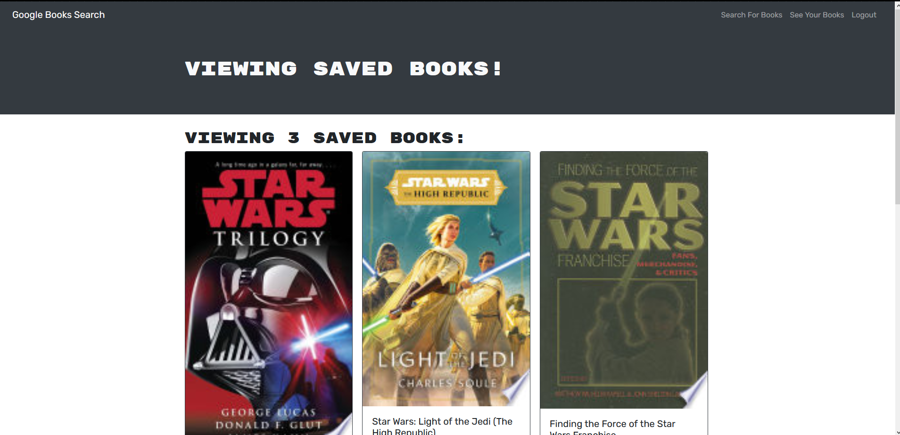

# Book Search Engine

## Description
  An app that uses Google's Book API to find books searched by a user. The user can create a profile, and sign in. When they do this they are able to save books, and view them. They can also remove the books from their saved lists.
  This app uses react.js for the front end. It uses Express.js for the server. It is a MongoDB using Mongoose.
  
## Images

## Created by
<h3>Josh Miller</h3>

## App
  The published app can be found at [https://mighty-thicket-20659.herokuapp.com/](https://mighty-thicket-20659.herokuapp.com/)
